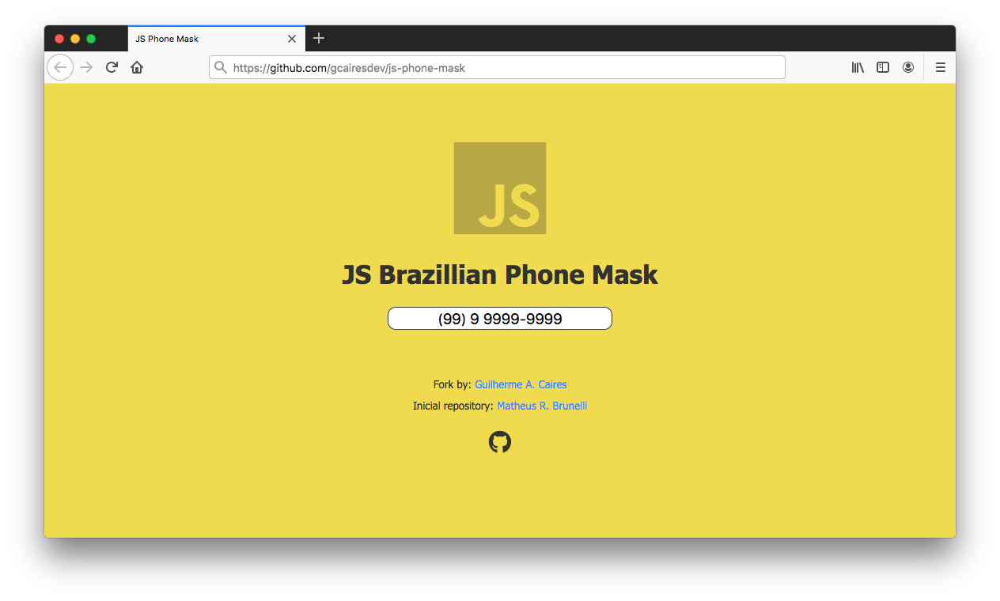

# Máscara para número de celular

> Corrige em tempo real, o valor dos inputs de número de celular do Brasil. Usando parênteses e o dígito 9.                   
> Formato da máscara: (00) 0 0000-0000

[![Code Size][code-size-image]][code-size-url]
[![Test Now][test-now-image]][test-now-url]

Teste agora: https://mrbrunelli.github.io/regexp-celular-javascript

> Contributor: [gcairesdev](https://github.com/gcairesdev)



## Como usar

1- Clone o repositório

```sh
git clone https://github.com/mrbrunelli/regexp-celular-javascript
```

2- Link o arquivo `phoneMask.js` em seu projeto

```html
<script src="phoneMask.js">
```

3- Adicione a propriedade `onkeyup` chamando a função `phoneMask()`, passando `event` como parâmetro
```html
<input type="text" onkeyup="phoneMask(event)"> 
```

## Exemplo de uso

Esta máscara pode ser usado em praticamente todos os formulários de perfil do usuário, sendo seu número de celular obrigatório ou não.

```html
<form method="post" action="/">
    <input type="text" name="nomeCompleto">
    <input type="email" name="email">
    <input type="text" name="celular" onkeyup="phoneMask(event)">
    <input type="submit" name="enviar" value="Enviar">
</form>
```

## Observação

Por estar usando o padrão internacional de expressões regulares, essa função pode ser convertida facilmente para qualquer linguagem de programação.

[code-size-image]: https://img.shields.io/github/languages/code-size/gcairesdev/js-phone-mask
[code-size-url]: https://github.com/mrbrunelli/regexp-celular-javascript/archive/master.zip
[test-now-image]: https://img.shields.io/badge/teste%20now-online-%23F0DB4F
[test-now-url]: https://mrbrunelli.github.io/regexp-celular-javascript/